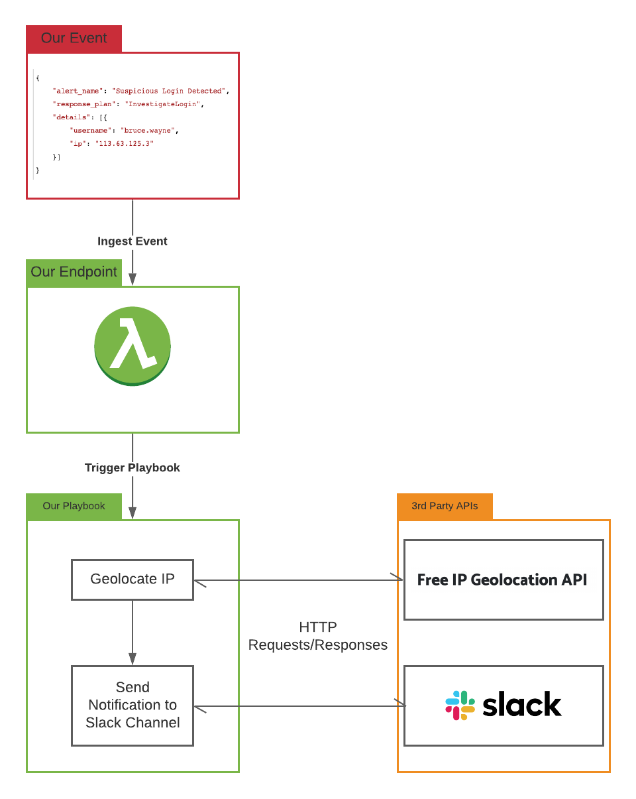

# Getting Started Tutorial
Welcome to the SOCless Getting Started Tutorial!

This tutorial will introduce you to key SOCless concepts by teaching you to write your first automated workflow!

In SOCless, automated workflows are called `Playbooks`. Playbooks are triggered by `Events`, and contain a series of coordinated steps called `States` that work towards an end goal. States can either:

* use `Integrations` to perform `Tasks` like making requests to APIs or run computations
* use `Interactions` to engage with humans, OR
* Control the flow of execution by making `Choices`, executing tasks in `Parallel`, or pausing execution for a time period

This tutorial focuses on using `Integrations` in `Playbooks` to automate a workflow. We'll cover other features of States in later tutorials.

We'll learn by creating a Playbook for a simple scenario: We've received an alert that a `username` logged in from a suspicious `ip`. We want to investigate it by geolocating `ip` the and posting the findings to a Slack channel.

To throw in some fun, we'll assume that our `username` is `bruce.wayne`. *Oh oh! Has someone hacked ~~Batman~~ Bruce Wayne?! We need to find out asap!*

In completing this tutorial, we'll learn how to:

* Write a playbook that uses SOCless' built-in [HTTPRequest Integration](../../reference/builtin-integrations/http_request.md) to make requests to APIs
* Create a SOCless Endpoint that knows how to process our alert and trigger our playbook
* Securely store and use credentials for 3rd Party APIs

Here's a diagram that shows how all the components we will create fit together

Head to the next page to get started!
