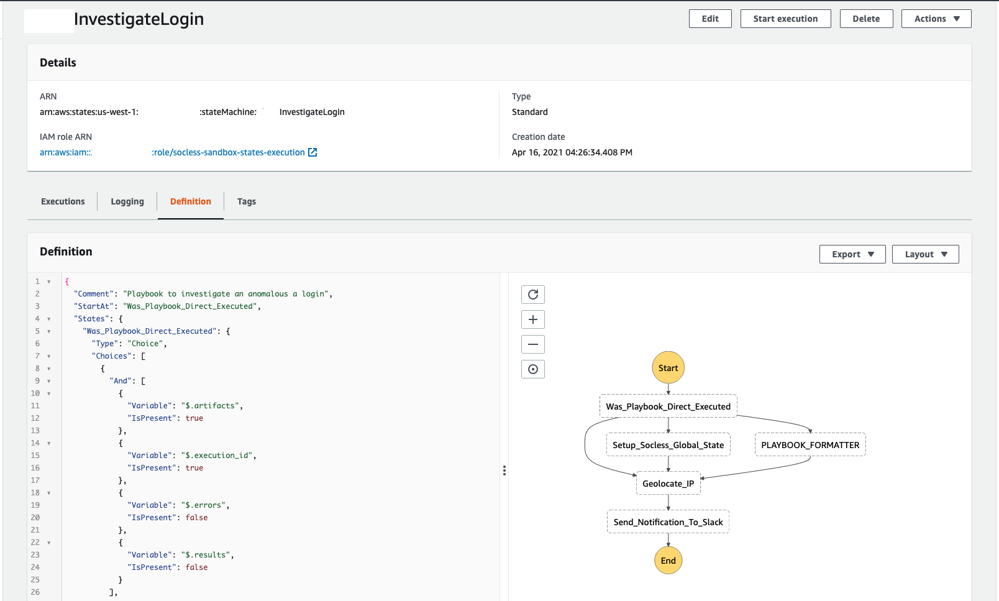

# Testing Our Playbook
First, let's view our SOCless Playbook in the AWS Console.

Execute the below command to log into SOCless and open the AWS Step Functions Console in the sandbox environment

```
socless auth login --web
```

SOCless playbooks are powered by the [AWS Step Functions](https://aws.amazon.com/step-functions/) service, which runs [State Machines](https://en.wikipedia.org/wiki/Finite-state_machine). At this point we don't need to know the details of either of those things. What's most important to know is that the command above should have landed us in the AWS Step Functions Console, which shows a list of State Machines.


In the search bar, search for our `[yourname]InvestigateLogin` state machine and click it.

Select the `Definition` tab to see a visual representation of our Playbook as well as the rendered code. It should look something like



!!! info "What's with all the additional states?!"
    The additional states ensure that the Playbook Execution Context is setup correctly when our playbook runs. SOCless automatically added these states when we deployed our playbook.


To test our playbook:

* Click the "Start Execution" button
* Paste the below test-case into the dialog that pops up
```json
--8<-- "docs-snippets/quick-start/playbook_details.json"
```
* Click "Start Execution"

Our Playbook should now be executing! The "Graph Inspector" on the resulting page will show each state as it executes.

If our playbook executes successfully:

* All states in our "Graph Inspector" should be green
* We should have a message in our `#bat-signals` channel that reads `bruce.wayne logged in from China at coordinates 34.7725, 113.7266`

If you run into any errors during execution, you can click on each state in the `Graph Inspector` and select either `Details`, `Step Input`, `Step Output` or `Exception` to inspect the execution


Congratulations! We've written our first Playbook! Pat yourself on the back and take a breather!


While directly executing our Playbook in the Console is great for testing, it beats the point of automation. We want some other system like a log aggregation platform or a webhook to trigger our Playbook's execution. To do this, we'll need to create an endpoint for our Playbook.

Let's move to the next section to get started on it.
