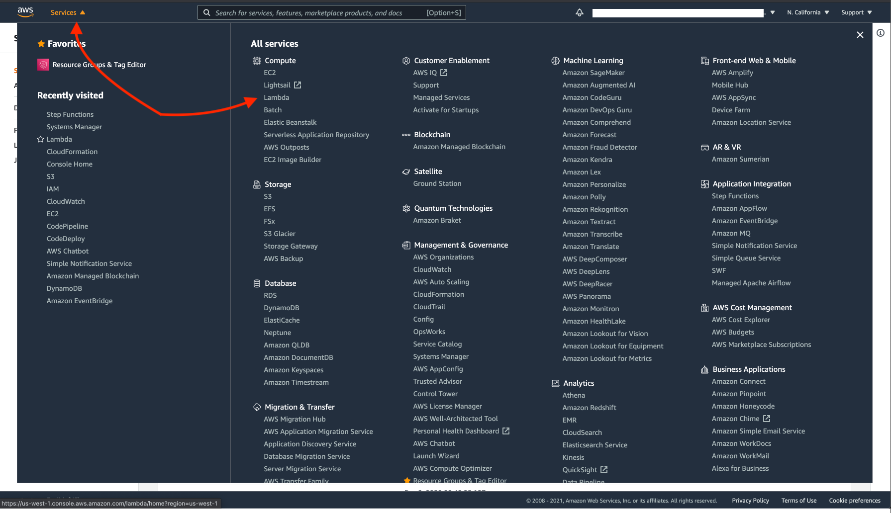
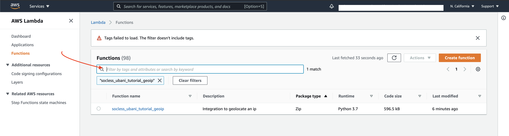
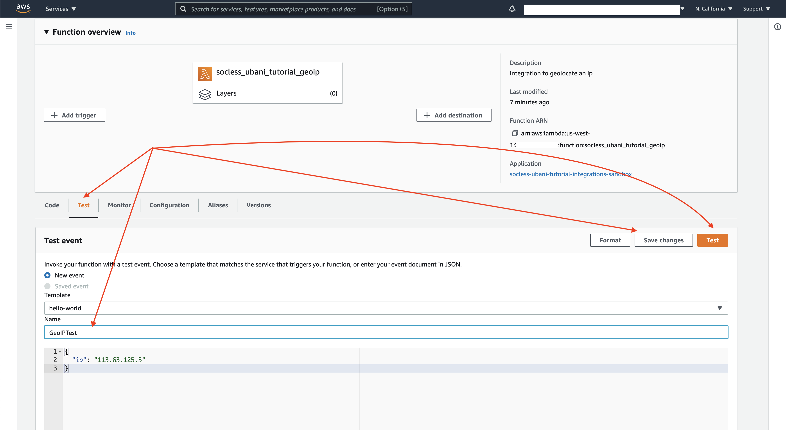
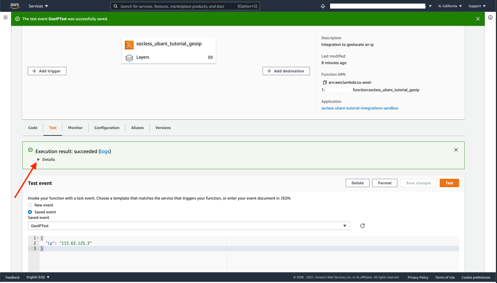

# Developing our GeoIP Integration
We'll cover a couple of things in this section

* Coding our Integration
* Specifying our Integrations dependencies
* Configuring the Integration for Deployment
* Deploying and testing the Integration.

Let's begin.

## Coding Our GeoIP Integration
In our Quickstart Tutorial, we geolocated an IP address using the HTTPRequest integration and the [Free IP Geolocation API](https://freegeoip.app/).

!!! tip
    Feel free to run the command below in your terminal for a refresher on the expected output from the Freegeoip API
    ```bash
    curl --request GET --url https://freegeoip.app/json/113.63.125.3
    ```

Our GeolocateIP Integration will use the same API to geolocate IPs.

The geolocation logic for our integration will:

* be implemented in a `handle_state` function that accepts only one parameter; `ip`.
* use the [Python Requests](https://docs.python-requests.org/en/master/) library to perform a `GET` request to `https://freegeoip.app/json/{ip}`
* Uses the `decimal` builtin library to correctly parse the floating point numbers (i.e latitude & longitude) that the Freegoip api returns
* return the json response we get back from our request
* Use `lambda_handler` + `socless_bootstrap` to handle its execution lifecycle

Here’s what the implementation of the integration described above looks like

```python
import requests
from socless import socless_bootstrap
from decimal import Decimal


def handle_state(ip):
    response = requests.get(f"https://freegeoip.app/json/{ip}")
    response.raise_for_status()
    return response.json(parse_float=Decimal)


def lambda_handler(event, context):
    return socless_bootstrap(event, context, handle_state)
```

In the `socless-tutorial-integrations/functions` directory,

* create a subdirectory called `geoip`
* create a file called `lambda_function.py` in the `geoip` directory
* Implement the code above in the `lambda_function.py` file.

We should now have a functions directory similar to the below with the above code in our `lambda_function.py` file

```
functions/
├── geoip
│   └── lambda_function.py
├── requirements.txt
```

And just like that, we've completed the code for our first Integration. :clap:

But we're not done yet.

Notice that our integration makes use of the Python `requests` library which isn’t one of the libraries pre-packaged with AWS Lambda. As such, we’ll need to specify `requests` as a dependency that SOCless should package with our function when its deployed. This can be done using the `requirements.txt` file we see in our directory. Let's do that next.

!!! tip "Delete our code samples!"
    There may be a folder in your `functions` directory called `send_old_timey_telegram`. This is a sample integration we include with our `socless-template` to guide people on how to write integrations. Feel free to take a look at its contents, but afterwards, delete the `send_old_timey_telegram` folder since we don't actually want to deploy the integration

!!! info "*"Wait. Explain the `Decimal` thing again, please?"*"
    Sure thing. Our Freegeoip API returns latitude and longitude as Floating Point numbers. However, Floating Point Number are tricky for SOCless to work with. SOCless prefers the Decimal type instead. So when parsing a response from an API that returns Floating Point numbers, we use `parse_float=Decimal` to instruct our code to convert those Floats to the Decimals that SOCless prefers. If we don't we'd get a gnarly error about Floating point numbers not being accepted.


## Specify Dependencies
 Open the pre-existing `requirements.txt` file in the functions directory, and add `requests` at the bottom of the file. Our file should end up looking similar to:

```yaml hl_lines="2"
git+https://github.com/twilio-labs/socless_python.git#egg=socless
requests
```
Any dependency listed in the `functions/requirements.txt` file gets deployed with all functions in the `functions` folder.

The first dependency in the file is the `socless_python` library that provides the `socless_bootstrap` function. When SOCless deploys our Integration, it will automatically package both `socless_python` and `requests` with it.

With our dependencies specified, we're now ready to configure our Integration for deployment.


## Configuring our Integration for Deployment
Integrations are configured for deployment in the `functions` section of our `serverless.yml`. Let's take a look at that section of our file. There should already be a sample function configured called `SendOldTimeyTelegram`. Study the configuration to get a sense of what we need to do to configure our `geo_ip` function for deployment.


Now let's configure a function named `GeoIP` directly under the `functions` section that has:

* the **handler**, `lambda_function.lambda_handler`
* the **name** `socless_[yourname]_tutorial_geoip`.
* the **description**: "Integration to geolocate an IP address"
* its **package** included from our `functions/geoip` folder

Here's what that configuration looks like:

```yaml
functions:
  GeoIP:
    name: socless_[yourname]_tutorial_geoip # Remember to replace [yourname]
    handler: lambda_function.lambda_handler
    description: Integration to geolocate an ip
    package:
      include:
        - functions/geoip
```

--8<-- "docs-snippets/replace_yourname.md"

!!! tip "Delete our sample code!"
    Now that our `GeoIP` function is configured, go ahead and remove the configuration for `SendOldTimeyTelegram` function.

    In addition, delete the `playbooks` section under `custom` (above `functions`) since we won't be deploying any Playbooks with this repository


Our function is now configured for deployment!

However, to enable us use our Integration in our Playbook, we need to `Output` its Arn. We'll explain why we do this shortly when we configure our Playbook to use these integrations, but for now scroll to the `Outputs` section of our file and study the `SendOldTimeyTelegram` Output there.

Then configure an Output for our `GeoIP` function as shown below

```yaml
resources:
  Outputs:
    GeoIP:
      Description: ARN of GeoIP integration
      Value:
        Fn::Sub: ${GeoIPLambdaFunction.Arn}		
```

 With that, our Integration is fully configured for deployment.

!!! tip "Delete our sample code!"
    Your `resources` section should look **exactly** as shown above. Delete the `Output` for `SendOldTimeyTelegram` as well as the `Resources` section contained under `resources`


## Deploying the Integration
To deploy our Integration, execute the following in your terminal in the same directory as the `serverless.yml` file

```
socless stack deploy
```

Once the deployment is complete, you should see output similar to the below

```yaml hl_lines="17"
Service Information
service: socless-[yourname]-tutorial-integrations
stage: sandbox
region: us-west-1
stack: socless-[yourname]-tutorial-integrations-sandbox
resources: 4
api keys:
  None
endpoints:
  None
functions:
  GeoIP: socless_[yourname]_tutorial_geoip
layers:
  None

Stack Outputs
GeoIP: arn:aws:lambda:us-west-1:xxxxxxxxxxxx:function:socless_[yourname]_tutorial_geoip
ServerlessDeploymentBucketName: socless-[yourname]-tutorial-i-serverlessdeploymentbuck-xxxxxxxxxxx
```

The `Stack Outputs` section should show the ARN for our `GeoIP` function. Don't worry about copying this to use in our Playbook. We'll show you how to reference it using a [Serverless Variable](../../reference/variables.md#serverless-variables) shortly.


## Testing the Integration
Log into the AWS console using

```
socless auth login --web
```

Then navigate to the AWS Lambda service, search for the Lambda function for the Integration we just deployed (i.e `socless_[yourname]_tutorial_geoip`) and open it.

Find the `Test` section and configure the below test event:
```json
{
  "ip": "113.63.125.3"
}
```

Save the test event with a name similar to `GeoIPTest`. Then click `Test`

The images below should help you find your way there

=== "Finding Lambda Console"
    [](./imgs/finding-lambda-console.png)

=== "Finding Your Function"
    [](./imgs/finding-your-function.png)

=== "Creating & Saving a Test"
    [](./imgs/creating-a-test.png)

=== "Viewing Results"
    [](./imgs/viewing-results.png)


If the test executes successfully, you'll have Execution result like below which shows the test event and the resulting geolocated IP in a `results.direct_invoke` object.

```json
{
  "ip": "113.63.125.3",
  "results": {
    "direct_invoke": {
      "ip": "113.63.125.3",
      "country_code": "CN",
      "country_name": "China",
      "region_code": "",
      "region_name": "",
      "city": "",
      "zip_code": "",
      "time_zone": "Asia/Shanghai",
      "latitude": 34.7725,
      "longitude": 113.7266,
      "metro_code": 0
    }
  }
}
```
Feel free to change the IP address in your test case and play around a little.

Congratulations! We've just written, deployed and tested our first integration. :clap:

Let's write our SendMessage Integration next.
