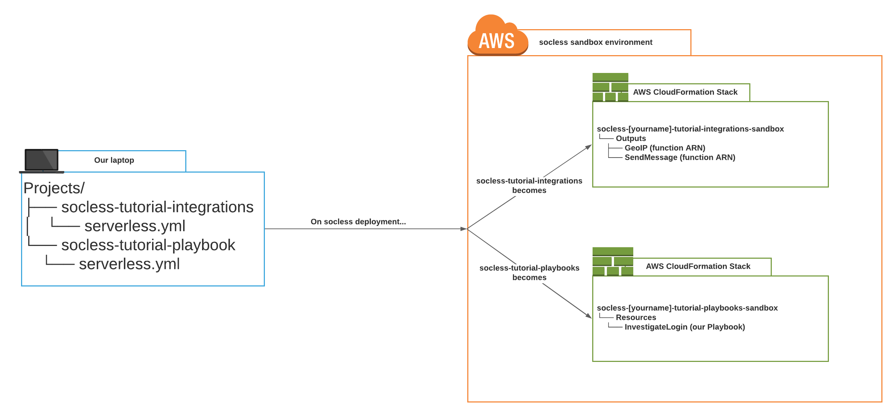
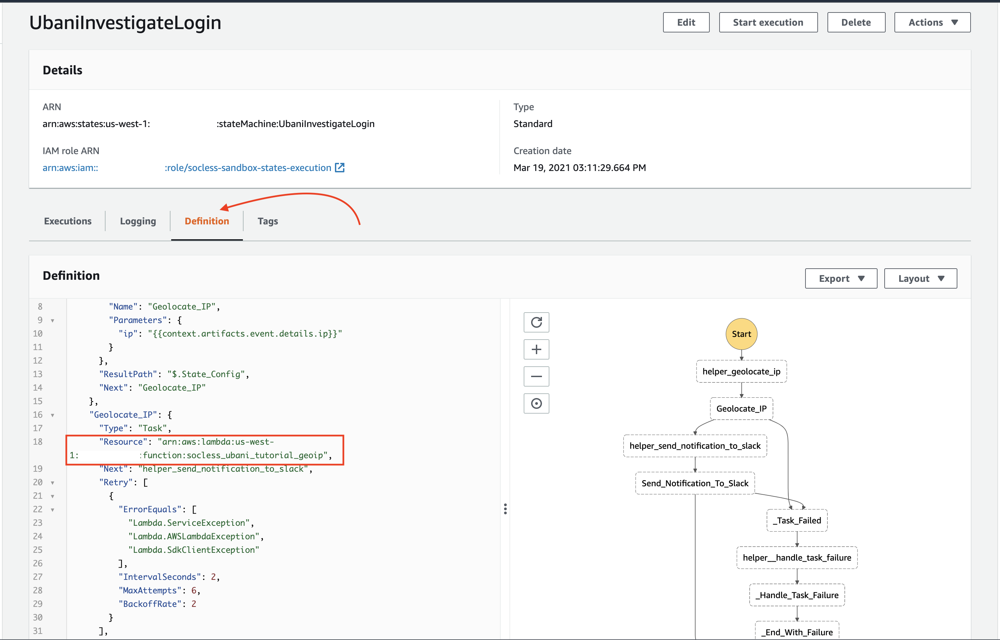

# Using Our Integrations in our InvestigateLogin Playbook

!!! note
    For this section, we'll be making changes to the `socless-tutorial-playbook` repository we developed in our [Getting Started Tutorial](../quick-start/introduction.md)


Let's go ahead and use our newly minted integrations in our InvestigateLogin playbook from the Getting Started Tutorial.

Open the `playbook.json` file for our `InvestigateLogin` playbook from the Getting Started Tutorial. It should be located at `socless-tutorial-playbook/playbooks/investigate_login/playbook.json`

The file should currently look similar to the below

```json hl_lines="8-12 17-28"
{{
  "Playbook": "UbaniInvestigateLogin",
  "Comment": "Playbook to investigate a login",
  "StartAt": "Geolocate_IP",
  "States": {
    "Geolocate_IP": {
      "Type": "Task",
      "Resource": "${{self:custom.core.HTTPRequest}}",
      "Parameters": {
        "method": "GET",
        "url": "https://freegeoip.app/json/{{context.artifacts.event.details.ip}}"
      },
      "Next": "Send_Notification_To_Slack"
    },
    "Send_Notification_To_Slack": {
      "Type": "Task",
      "Resource": "${{self:custom.core.HTTPRequest}}",
      "Parameters": {
        "method": "POST",
        "url": "https://slack.com/api/chat.postMessage",
        "params": {
          "channel": "#bat-signals",
          "text": "`{{context.artifacts.event.details.username}}` logged in from `{{context.results.Geolocate_IP.json.country_name}}` at coordinates `{{context.results.Geolocate_IP.json.latitude}}`, `{{context.results.Geolocate_IP.json.longitude}}`"
        },
        "headers": {
          "Authorization": "Bearer {{secret('/socless/slack/bot_token')}}"
        }
      },
      "End": true
    }
  },
  "Decorators": {
    "TaskFailureHandler": {
      "Type": "Task",
      "Resource": "${{self:custom.core.HTTPRequest}}",
      "Parameters": {
        "method": "POST",
        "url": "https://slack.com/api/chat.postMessage",
        "params": {
          "channel": "#bat-signals",
          "text": "An error occurred in the our [yourname]InvestigateLogin playbook.\n ExecutionID: {{context.execution_id}} \n Error:\n ```{{context.errors}}```"
        },
        "headers": {
          "Authorization": "Bearer {{secret('/socless/slack/bot_token')}}"
        }
      },
      "End": true
    }
  }
}
```

When we wrapped up our Getting started tutorial, our `Geolocate_IP` and `Send_Notification_To_Slack` states were both using the builtin [HTTPRequest Integration](../../reference/builtin-integrations/http_request.md) as the `Resource` to execute their functionality. They were also passing the type of `Parameters` that the HTTPRequest Integration expected.


To use our new GeoIP and SendMessage integrations, we'll simply

* Change the `Resource` value to reference our new integrations.
* Update the `Parameters` for each to match what those integrations expect.

Let's start first by updating `Parameters` for each state to match what our new integrations expect.

## Update the Parameters For Playbook
Unlike the `HTTPRequest` integration, our new `GeoIP` integration only expects an `ip` as its parameter. So update the `Parameters` object of the `Geolocate_IP` state to a single `ip` key that that's set to `{{context.artifacts.event.details.ip}}`.


Our Slack `SendMessage` integration, expects `channel`, `text`, and `bot_token` parameters. Update the `Send_Notification_To_Slack` to Slack state as such:

- Set `channel` to #bat-signals
- Set `text` to
```
"`{{context.artifacts.event.details.username}}` logged in from `{{context.results.Geolocate_IP.country_name}}` at coordinates `{{context.results.Geolocate_IP.latitude}}`, `{{context.results.Geolocate_IP.longitude}}`"
```
!!! note
    While this `text` looks almost like the text in our current playbook, **its slightly different!**

    Our existing text references the `country`, `latitude` & `longitude` using the variable `{{context.results.Geolocate_IP.json.*}}` but this updated one doesn't have the `.json`!


     That's because while `HTTPRequest` integration returned the latitude/longitude in a `json` object, our `GeoIP` integration doesn't

- Set `bot_token` to `{{secret('/socless/slack/bot_token')}`


After the changes, our `playbook.json` should look similar to the below

```json hl_lines="9-11 17-21"
{
  "Playbook": "[yourname]InvestigateLogin",
  "Comment": "Playbook to investigate a login",
  "StartAt": "Geolocate_IP",
  "States": {
    "Geolocate_IP": {
      "Type": "Task",
      "Resource": "${{self:custom.core.HTTPRequest}}",
      "Parameters": {
        "ip": "{{context.artifacts.event.details.ip}}"
      },
      "Next": "Send_Notification_To_Slack"
    },
    "Send_Notification_To_Slack": {
      "Type": "Task",
      "Resource": "${{self:custom.core.HTTPRequest}}",
      "Parameters": {
        "channel": "#bat-signals",
        "text": "`{{context.artifacts.event.details.username}}` logged in from `{{context.results.Geolocate_IP.country_name}}` at coordinates `{{context.results.Geolocate_IP.latitude}}`, `{{context.results.Geolocate_IP.longitude}}`",
        "bot_token": "{{secret('/socless/slack/bot_token')}}"
      },
      "End": true
    }
  },
  "Decorators": {
    "TaskFailureHandler": {
      "Type": "Task",
      "Resource": "${{self:custom.core.HTTPRequest}}",
      "Parameters": {
        "method": "POST",
        "url": "https://slack.com/api/chat.postMessage",
        "params": {
          "channel": "#bat-signals",
          "text": "An error occurred in the our [yourname]InvestigateLogin playbook.\n ExecutionID: {{context.execution_id}} \n Error:\n ```{{context.errors}}```"
        },
        "headers": {
          "Authorization": "Bearer {{secret('/socless/slack/bot_token')}}"
        }
      },
      "End": true
    }
  }
}
```

And just like that, we've update our `Parameters` to match what our new integrations expect!

But we're still using the `HTTPRequest` `Resource` in both states. Let's update those to our new integrations next.

We'll start by getting a quick understanding of References and Outputs

## Understanding References and Outputs

At this point in our tutorial, we've deployed two SOCless repositories:

- our `socless-tutorial-playbook` repository which houses our `InvestigateLogin` playbook
- our `socless-tutorial-integration` repository which has our `GeoIP` and `SendMessage` integrations.

When we deployed these repositories, SOCless created infrastructure in our AWS Environment via an AWS Service called [CloudFormation](https://aws.amazon.com/cloudformation/).

The most important thing we need to know about CloudFormation at this point is this: Each SOCless repository is deployed as its own CloudFormation `Stack`, which is how CloudFormation groups `Resources` that are deployed together.

Every `Stack` has a name. For SOCless repositories, the stack name follows the format

```
[serverless.yml service name]-[socless environment name]
```

The `[serverless.yml service name]` is the `service` value on line 1 of each `serverless.yml` file. Take a look at both `serverless.yml` files for our SOCless repositories to see what they are.


The `[socless environment name]` is the name of the SOCless Environment the stack was deployed. This is typically is typically either `sandbox`, `dev`, `stage`, `prod`.

Since we've been deploying to the `sandbox`, the stack names for our repositories should be:

* `socless-[yourname]-tutorial-playbook-sandbox` for our `socless-tutorial-playbook` repo
* `socless-[yourname]-tutorial-integrations-sandbox` for our `socless-tutorial-integrations` repo

Here's a visual representation of the above explanation
 [](./imgs/socless-stacks-explained.png)
 (Click to enlarge)


As shown above, each Stack is isolated from each other. However, we're able to use information from one stack in another stack by creating references to that information in the `serverless.yml` file of the Stack that needs it.


These references are created using [Serverless Variables](../../reference/variables.md#serverless-variables).

!!! note
    `Serverless Variables` are completely different from the `Template Variables` we covered in the Getting Started Tutorial. To learn more about both and their differences, refer to our [Variables](../../reference/variables.md) documentation

To reference an Output from a Stack, The Serverless Variable we use takes the form:
```
${{cf:[stack-name].[output name]}}
```
The `cf:` part stands for `CloudFormation`.

For example, to reference the `GeoIP` integration that lives in our `socless-[yourname]-tutorial-integrations-sandbox` Stack, the Serverless Variable we'd use would look something similar to

```
${{cf:socless-[yourname]-tutorial-integrations-sandbox.GeoIP}}
```

***"But waaaait a second. A SOCless Stack can be deployed to multiple environments right? Won't hardcoding the `sandbox` environment name cause an error when I deploy to `dev`, `stage`, `prod`?!"***


You're absolutely correct!

To address this issue, we also need to replace `[socless environment name]` with a Serverless Variable. However, instead of referencing a CloudFormation Stack, we'll reference the `provider.stage` value contained in `serverless.yml` as it holds the SOCless environment name.

Our final variable would look like the below

```
${{cf:socless-[yourname]-tutorial-integrations-${{self:provider.stage}}.GeoIP}}
```

Custom variables such as these are defined in the `custom` section of our `serverless.yml`. Once they're defined in the `custom` section, they can be referenced in our `playbook.json`

As an example, if we configured a reference to that variable above in our `serverless.yml` as such:

```yaml
custom:
  myCustomIntegrations:
    GeoIP: ${{cf:socless-[yourname]-tutorial-integrations-${{self:provider.stage}}.GeoIP}}
```

We can reference it in our playbook as `${{self:custom.myCustomIntegrations.GeoIP}}`

So to recap, using a custom integration in a playbook involves the following steps:

* Develop and deploy the integration (we've already done this)
* Reference the integration in the `serverless.yml` for our Playbook repository using Serverless Variables (we're about to do this next)
* Use that reference as the `Resource` for our Integrations (last thing we'll do)


Let's reference our GeoIP and SendMessage integrations in our `socless-tutorial-playbook` repo next

## Update the Resources for our Playbook
Open the `serverless.yml` in our `socless-tutorial-playbook` folder, which we created during the Getting Started Tutorial.

Look for the section titled `custom`. Currently, it should look similar to the below


```yaml
custom:
  soclessPackager:
    buildDir: build
  core:
    SetInvestigationStatus: ${{cf:socless-${{self:provider.stage}}.SetInvestigationStatus}}
    MergeParallelOutput: ${{cf:socless-${{self:provider.stage}}.MergeParallelOutput}}
    HTTPRequest: ${{cf:socless-${{self:provider.stage}}.HTTPRequest}}
    AWSRequest: ${{cf:socless-${{self:provider.stage}}.AWSRequest}}

```


Under the custom section, let's create references to our `GeoIP` and `SendMessage` integrations under a subsection called `tutorial`.


Our output should look similar to the below

```yaml hl_lines="9-11"
custom:
  soclessPackager:
    buildDir: build
  core:
    SetInvestigationStatus: ${{cf:socless-${{self:provider.stage}}.SetInvestigationStatus}}
    MergeParallelOutput: ${{cf:socless-${{self:provider.stage}}.MergeParallelOutput}}
    HTTPRequest: ${{cf:socless-${{self:provider.stage}}.HTTPRequest}}
    AWSRequest: ${{cf:socless-${{self:provider.stage}}.AWSRequest}}
  tutorial:
    GeoIP: ${{cf:socless-[yourname]-tutorial-integrations-${{self:provider.stage}}.GeoIP}}
    SendMessage: ${{cf:socless-[yourname]-tutorial-integrations-${{self:provider.stage}}.SendMessage}}
```

!!! note "Replace [yourname]"
    Don't forget to replace `[yourname]` above!


We've just successfully configured references to our `socless-tutorial-integrations`!

We can now use these references within our `InvestigateLogin` playbook as `${{self:custom.tutorial.GeoIP}}` and `${{self:custom.tutorial.SendMessage}}`

Open the `playbook.json` and update the `Resource` fields of our `Geolocate_IP` and `Send_Notification_To_Slack` to use our new integrations. Our `playbook.json` should now look like the below

```json hl_lines="8 16"
{
  "Playbook": "[yourname]InvestigateLogin",
  "Comment": "Playbook to investigate a login",
  "StartAt": "Geolocate_IP",
  "States": {
    "Geolocate_IP": {
      "Type": "Task",
      "Resource": "${{self:custom.tutorial.GeoIP}}",
      "Parameters": {
        "ip": "{{context.artifacts.event.details.ip}}"
      },
      "Next": "Send_Notification_To_Slack"
    },
    "Send_Notification_To_Slack": {
      "Type": "Task",
      "Resource": "${{self:custom.tutorial.SendMessage}}",
      "Parameters": {
        "channel": "#bat-signals",
        "text": "`{{context.artifacts.event.details.username}}` logged in from `{{context.results.Geolocate_IP.country_name}}` at coordinates `{{context.results.Geolocate_IP.latitude}}`, `{{context.results.Geolocate_IP.longitude}}`",
        "bot_token": "{{secret('/socless/slack/bot_token')}}"
      },
      "End": true
    }
  },
  "Decorators": {
    "TaskFailureHandler": {
      "Type": "Task",
      "Resource": "${{self:custom.core.HTTPRequest}}",
      "Parameters": {
        "method": "POST",
        "url": "https://slack.com/api/chat.postMessage",
        "params": {
          "channel": "#bat-signals",
          "text": "An error occurred in the our [yourname]InvestigateLogin playbook.\n ExecutionID: {{context.execution_id}} \n Error:\n ```{{context.errors}}```"
        },
        "headers": {
          "Authorization": "Bearer {{secret('/socless/slack/bot_token')}}"
        }
      },
      "End": true
    }
  }
}
```

Our `InvestigateLogin` playbook is now configured to use our custom integrations!

The last step to apply our changes is to deploy and test our playbook

!!! tip
    Our `TaskFailureHandler` is still using the `HTTPRequest` integration. But since it also sends a Slack message, we can update it to use our new SendMessage Integration as well! We'll leave those updates to you as an exercise


## Deploy and Test our Playbook
To deploy our playbook, execute the below code in our `socless-tutorial-playbook` folder

```
socless stack deploy
```


We can confirm that our playbook is now using our integrations by reviewing our playbook definition in the AWS Step Functions console.

* Execute the below to open the AWS Step Functions console and review our playbook

  ```
  socless auth login --web
  ```

* Search for your playbook and click it.
* On the resulting page, click the `Definition` tab and scroll through for the `Resource` configurations of our `Geolocate_IP` and `Send_Notification_To_Slack` slack states. We should see that they're now set to ARNs that match our `socless_[yourname]_tutorial_geoip` and `soclesss_[yourname]_tutorial_send_message` integration functions as shown in the sample image below




Let's go ahead and test our playbook!

We can test it either via are endpoint using `curl`, OR via the AWS Step Functions console since we're currently logged in. Both options are explained below. Your choice.


=== "Testing via AWS Console"
    To test via the AWS Console,

    * Click the `Start Execution` button in the top-right corner of the AWS Step Function page for our Playbook
    * Paste the below test payload in the dialog box and click `Start Execution`
    ```json
    {
      "_testing": true,
      "artifacts": {
        "event": {
          "details": {
            "username": "bruce.wayne",
            "ip": "113.63.125.3"
          }
        }
      }
    }
    ```

=== "Testing using Curl"
    To test via curl, execute the below command in  your terminal while inside the `socless-tutorial-playbook` folder.

     You'll need to have your endpoint url and auth token saved as `ENDPOINT_URL` and `AUTH_TOKEN` environment variables in your terminal for the command to work

    ```
    curl -v -H "Authorization: $AUTH_TOKEN" -X POST $ENDPOINT_URL -d @playbooks/investigate_login/test_case.json
    ```


And that's it! We're successfully using our own custom integrations now with our `InvestigateLogin` playbook
